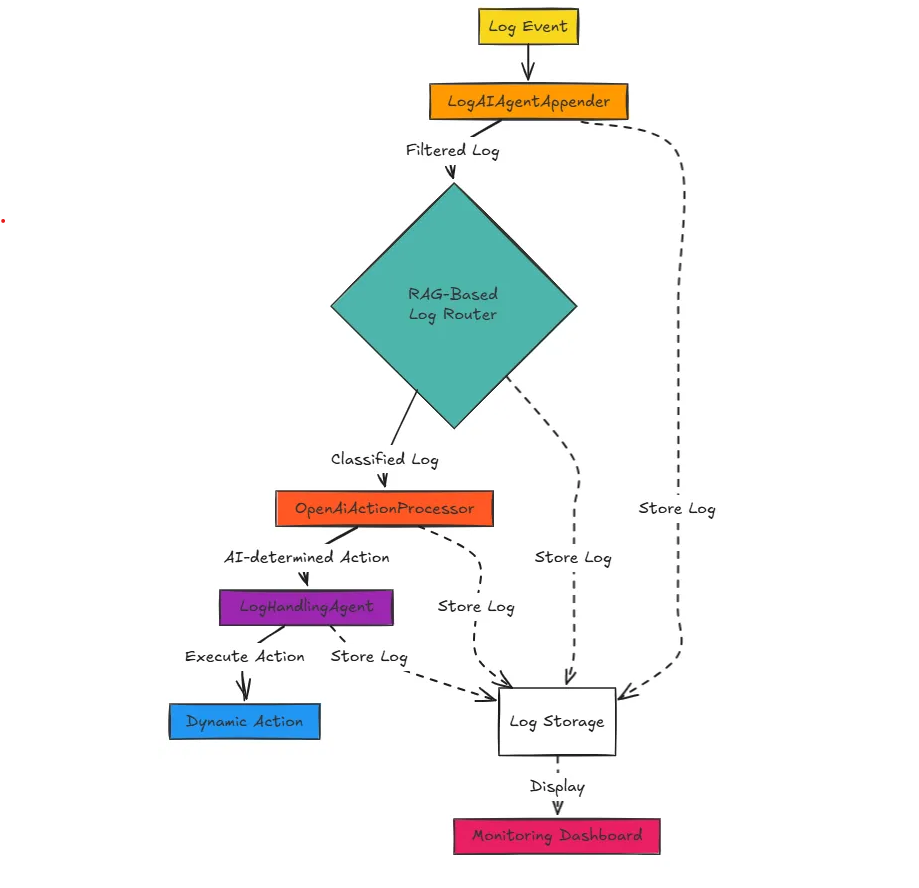
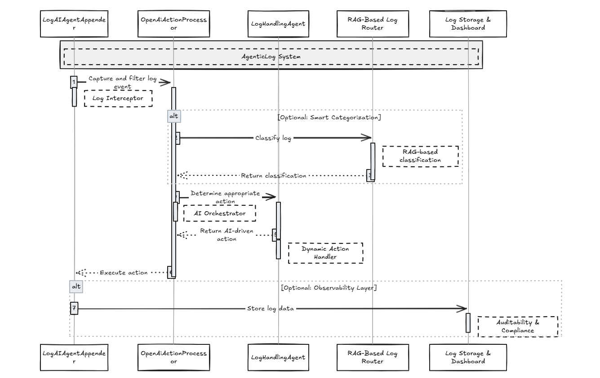

# **AgenticLog - AI-Driven Log Processing**

## **Overview**
AgenticLog is an intelligent logging system that leverages AI to **automatically process log messages** and take appropriate actions based on their context. Instead of relying on static rule-based processing, it uses an **agentic approach** to dynamically route logs to the correct handlers.

</img>
## **How It Works**
1. **Log messages are captured** using a custom appender.
2. **AI processes the log content** and determines the best action to take.
3. **Actions are executed dynamically** based on the extracted intent from the logs.

</img>

For example:

``` logger.error("ERROR customer-support error, customer ID 12345, query: \"What is the status of my order?\""); ```

The AI detects a customer inquiry and call

``` createSupportTicket(customerId, query) ```

If the log contains an escalation request

``` escalateIssue(errorMessage) ```